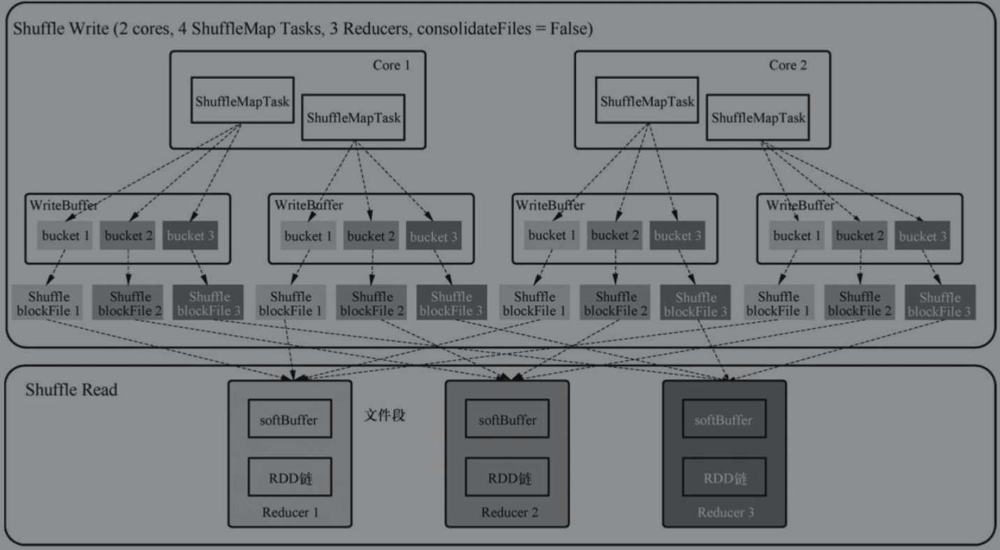
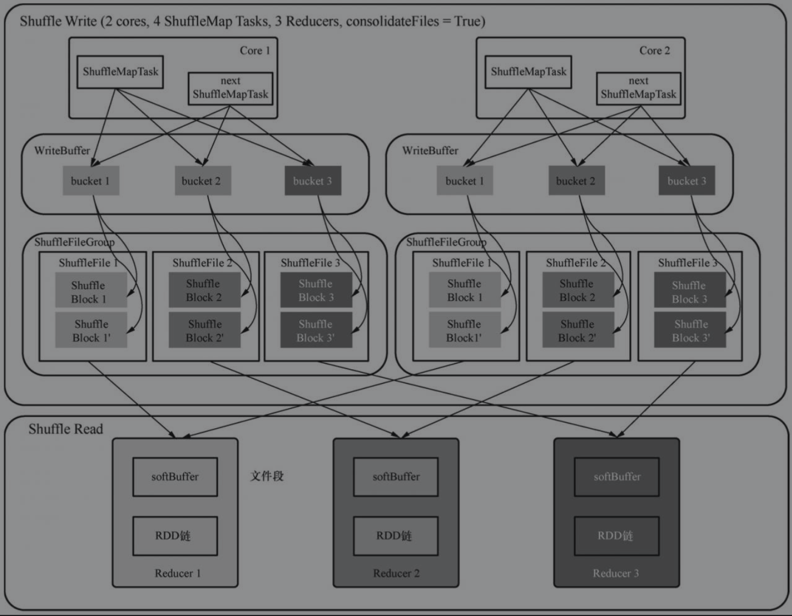
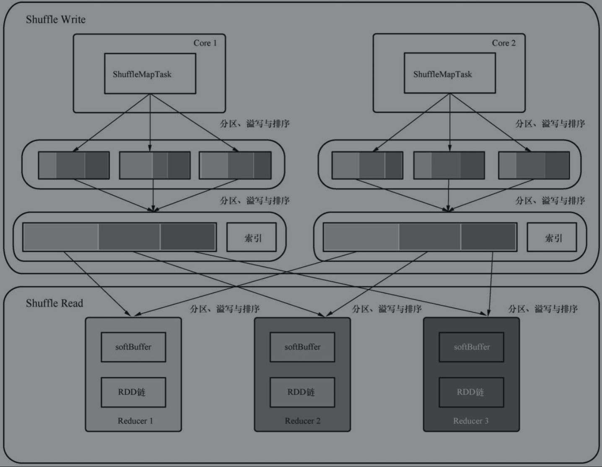

[toc]

# Spark Shuffle

很多算子都会引起RDD中的数据进行重分区，新的分区被创建，旧的分区被合并或者被打碎。在重分区的过程中，数据跨节点移动被称为Shuffle，在Spark中，Shuffle负责将Map端的处理的中间结果传输到Reduce端供Reduce端聚合，它是MapReduce类型计算框架中最重要的概念也是消耗性能巨大的步骤，它体现了从函数式编程接口到分布式计算框架的实现。

与MapReduce的Sort-based Shuffle不同，Spark对Shuffle的实现有两种：Hash Shuffle与Sort-basedShuffle，

这其实是一个优化的过程。在较老的版本中，Spark Shuffle的方式可以通过spark.shuffle. manager配置项进行配置，而在新的Spark版本中，已经去掉了该配置，统一为Sort-based Shuffle。

## Hash Shuffle (Deprecated)

在Spark 1.6.3之前，Hash Shuffle都是Spark Shuffle的解决方案之一。Shuffle的过程一般分为两个部分：Shuffle Write和Shuffle Fetch，前者是Map任务划分分区、输出中间结果，而后者则是Reduce任务获取到这些中间结果

Shuffle Write发生在一个节点上，该节点用来执行Shuffle任务的CPU核数为2，每个核可以同时执行两个任务，每个任务输出的分区数与Reducer数相同，即为3，每个分区都有一个缓冲区（bucket）用来接收结果，每个缓冲区的大小由配置spark.shuffle.file.buffer.kb决定。这样每个缓冲区写满后，就会输出到一个文件段（filesegment），而Reducer就会去相应的节点拉取文件。这样的实现很简单，但是问题也很明显。

生成的中间结果文件数太大。理论上，每个Shuffle任务输出会产生R个文件（R为Reducer的个数），而Shuffle任务的个数往往由Map任务个数M决定，所以总共会生成M×R个中间结果文件，而往往在一个作业中M和R都是很大的数字，在大型作业中，经常会出现文件句柄数突破操作系统限制。

缓冲区占用内存空间过大。单节点在执行Shuffle任务时缓存区大小消耗为m×R×spark.shuffle.file.buffer.kb, m为该节点运行的Shuffle任务数，如果一个核可以执行一个任务，m就与CPU核数相等。这对于动辄32、64物理核的服务器来说，是比不小的内存开销。

为了解决第一个问题，Spark推出过File Consolidation机制，旨在通过共用输出文件以降低文件数

当每次Shuffle任务输出时，同一个CPU核心处理的Map任务的中间结果会输出到同分区的一个文件中，然后Reducer只需一次性将整个文件拿到即可。那么这样的话，Shuffle产生的文件数为C（CPU核数）×R。Spark的FileConsolidation机制默认开启，可以通过spark.shuffle.consolidateFiles配置项进行配置。

## Sort-based Shuffle

在Spark先后引入了Hash Shuffle与FileConsolidation后，还是无法根本解决中间文件数太大的问题

Sort-based Shuffle，才真正解决了Shuffle的问题，再加上Tungsten项目的优化，Spark的Sort-based Shuffle比MapReduce的Sort-based Shuffle更为优异

每个Map任务最后只会输出两个文件（其中一个是索引文件），其中间过程采用的是与MapReduce一样的归并排序，但是会用索引文件记录每个分区的偏移量，输出完成后，Reducer会根据索引文件得到属于自己的分区，在这种情况下，Shuffle产生的中间结果文件数为2×M（M为Map任务数）。

在Sort-based Shuffle中，Spark还提供了一种折中方案——Bypass Sort-based Shuffle，当Reduce任务小于spark.shuffle.sort.bypassMergeThreshold配置（默认200）时，SparkShuffle开始按照Hash Shuffle的方式处理数据，而不用进行归并排序，只是在Shuffle Write步骤的最后，将其合并为1个文件，并生成索引文件。这样实际上还是会生成大量的中间文件，只是最后合并为1个文件并省去了排序所带来的开销，该方案准确的说法是Hash Shuffle的ShuffleFetch优化版。

Spark在1.5版时开始了Tungsten项目，也在1.5.0、1.5.1、1.5.2版的时候推出了一种tungsten-sort的选项，这是一种成果应用，类似于一种实验，该类型Shuffle本质上还是排序的Shuffle，只是用UnsafeShuffleWriter进行Map任务输出，并采用了与前面介绍的BytesToBytesMap相似的数据结构，把对数据的排序转化为对指针数组的排序，能够基于二进制数据进行操作，对GC有了很大提升，但是该方案对数据量有一些限制，随着Tungsten项目的逐渐成熟，该方案在1.6版就消失不见了。

