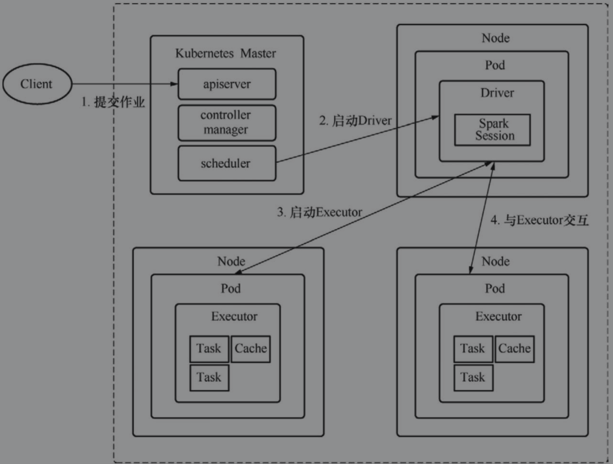

[toc]


# Spark On Kubernetes

Kubernetes本身也是主从架构，KubernetesMaster是Kubernetes集群的主节点，负责与客户端交互、资源调度和自动控制，Node是从节点，可以运行在虚拟机和物理机上，主要功能是承载Pod的运行，Pod的创建和启停等操作由Node的Kubelet组件控制，Pod是若干容器的组合，同一个Pod的容器运行在同一个宿主机上，Pod是Kubernetes能够进行创建、调度和管理的最小单位。


## 架构

客户端向Kubernetes Master提交作业，调度器分配资源启动Pod和Spark Driver, Driver创建运行在Pod中的Executor，并开始执行应用代码，当应用终止时，Executor所在的Pod也随之终止并销毁，但Driver会保留日志与“complete”状态，直到最终垃圾回收或者被手动清除。




# Spark on yarn vs Spark on k8s

```
spark-submit ---- ResourceManager ----- ApplicaitonMaster（Container） ---- Driver（Container）----Executor（Container）
```

```
spark-submit ---- Kube-api-server（Pod） ---- Kube-scheduler（Pod） ---- Driver（Pod） ---- Executor（Pod）
```


