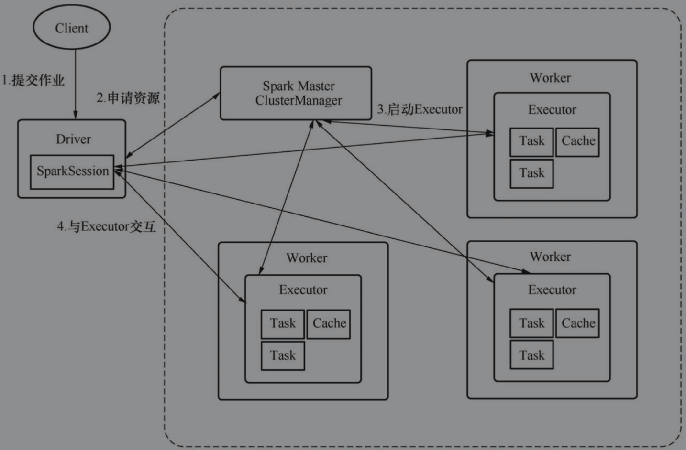

[toc]

# Spark Standalone

在Spark Standalone中，Spark集群自己管理资源与调度，在这个模式中，Spark客户端依然存在，作业通过Spark客户端提交到Spark集群

在Mesos与Standalone模式中，Driver承担了计算任务调度与资源调度的工作，而在YARN中，Driver只承担了计算任务调度的工作，其余工作由Application Master完成。造成差异的原因在于，Mesos与Standalone模式可以被认为是Spark原生模式，核心只是ClusterManager实现不同，其余设计思路都高度一致。但在YARN中，就必须按照YARN的规则来实现，对于一个YARN应用来说，Application Master是不可或缺的

