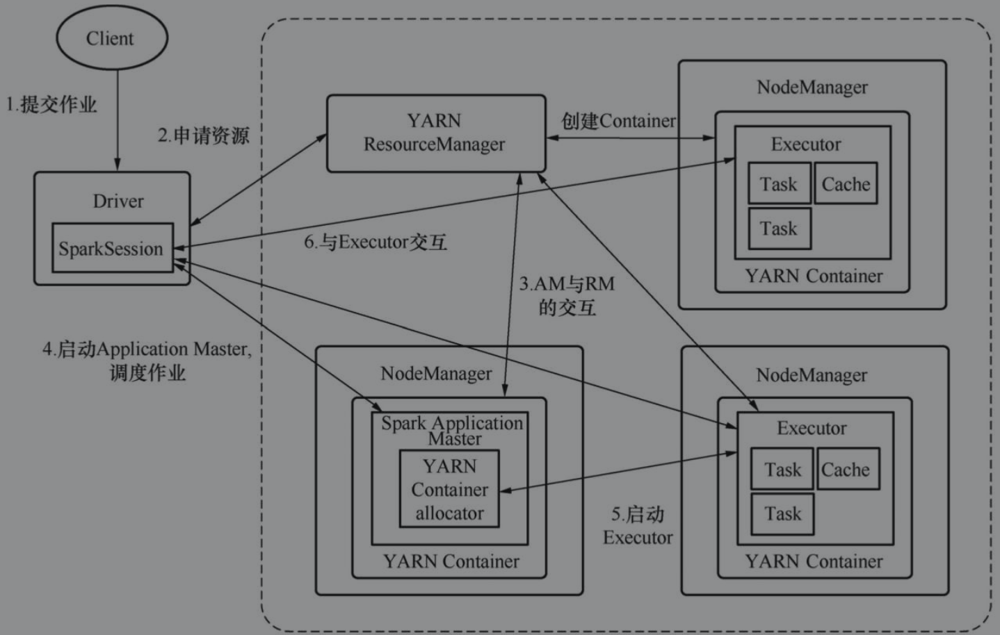
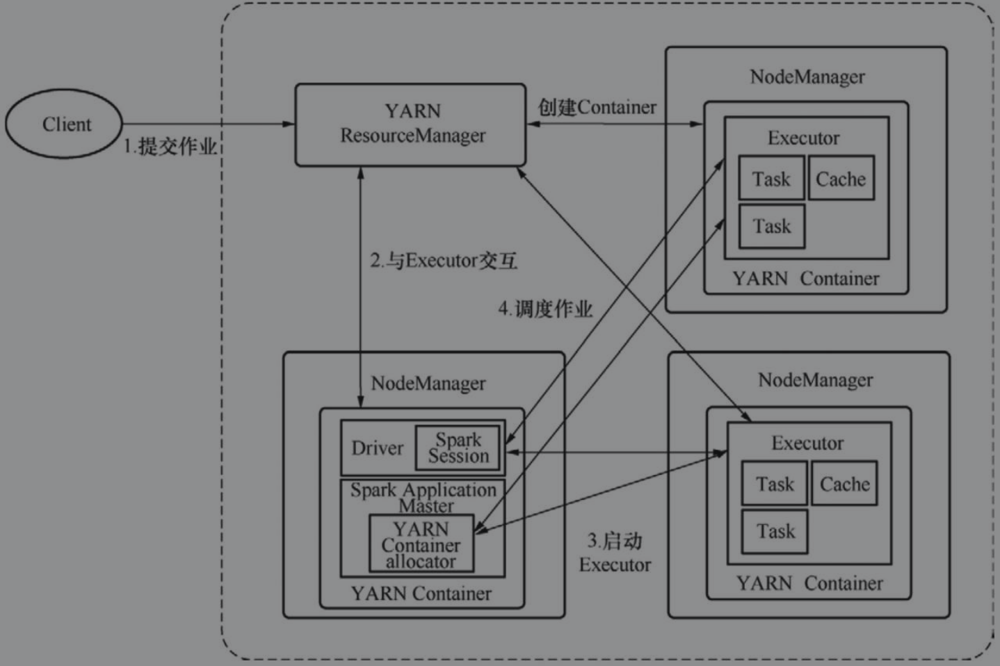
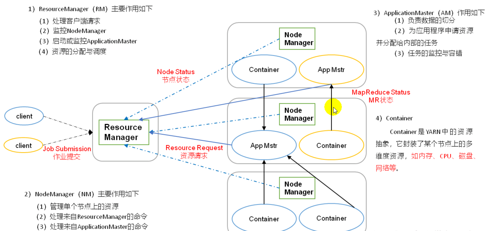

[toc]

# Spark on Yarn

Spark on YARN是生产环境中最为常见的部署方式，YARN（Yet Another ResourceNegotiator）是Hadoop 2.0区别于之前版本的重大改进，得益于Hadoop的普及，YARN是目前最为普遍的资源管理与调度平台

用户只需要通过Spark客户端来提交作业，而作业的执行在YARN的Container中完成，资源调度由YARN的Application Master完成，计算任务调度由Spark的Driver完成

用户首先在客户端（该客户端会部署Spark）提交作业，Driver会向YARN的ResourceManager申请资源，这时YARN会在集群中随机选取一个Container启动Spark Application Master作为二级资源调度器并回应Driver，

接着Driver会和Spark Application Master通信，SparkApplication Master会调度申请到的资源启动Executor开始计算任务，在作业执行过程中，Driver会和Executor保持通信。

在这种模式中，Spark的计算节点可能会运行在YARN中的任意节点，但Spark的Driver不会运行在YARN中，而运行在用户提交任务的节点，因此这种模式也被称为yarn-client。Spark on YARN还有一种模式是yarn-cluster，该模式与yarn-client模式大同小异，区别主要在于Driver会运行在YARN中，而且一般与Application Master运行在同一个节点

yarn-client

yarn-cluster

## 和Yarn 集群交互

1. Client submit 任务
2. ResourceManager选择一个NodeManager创建ApplicationMaster，ApplicationMaster集群Driver（即初始化sc）
3. ApplicationMaster向ResourceManager申请资源
4. ResourceManager返回集群资源列表
5. ApplicationMaster向NodeManager创建spark执行器对象，即Container 中的Executor
6. Executor反向注册到ApplicationMaster
7. ApplicationMaster分解任务，然后发给Executor执行

