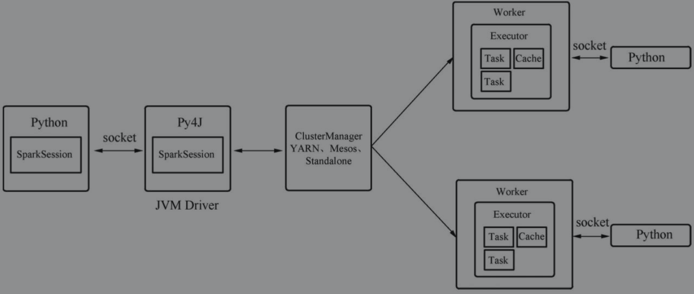
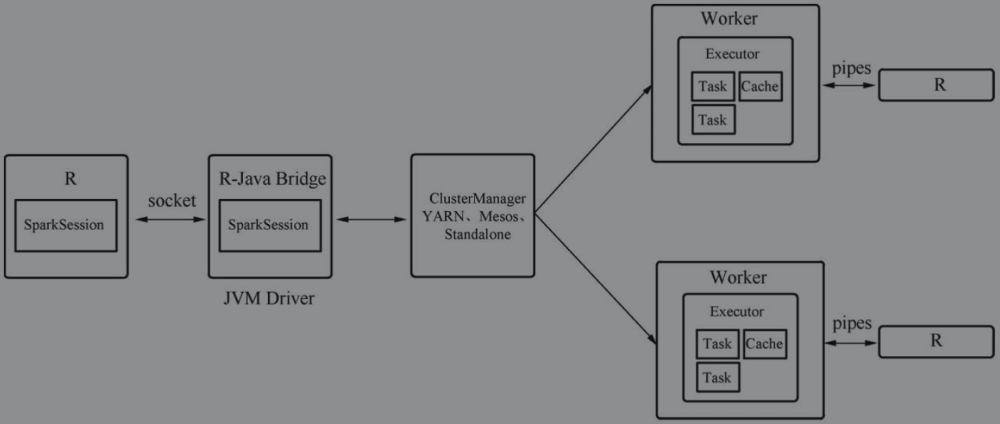

[toc]


# Spark shell

Spark Shell是Spark提供的一种基于Scala的REPL（Read-Eval-Print-Loop）交互式解释器环境, 可以作即时数据分析。

类似 R、Python、Scala 所 提供的 shell，然而和其他 shell 工具不一样的是，在其他 shell 工具中你只能使 用单机的硬盘和内存来操作数据，而 Spark shell 可用来与分布式存储在许多机器的内存或 者硬盘上的数据进行交互，并且处理过程的分发由 Spark 自动控制完成。

用户可以通过Spark Shell编码、配置并提交作业，Spark Shell本质上是对spark-submit命令的客户端模式的封装，用户可以在执行spark-shell脚本时加上启动参数，如--num-executors等


## pyspark

PySpark基于Spark的Java API，提供了Spark Python应用的运行环境和编程接口。

用户提交作业后，会启动一个Python版的SparkSession，其中SparkContext会通过Py4J启动一个JVM并创建一个JavaSparkContext。

Py4J只在Driver端用于JavaSparkContext与Python之间的本地通信，而中间结果的传输（Shuffle）则没有采用Py4J，而是使用Spark自己的数据传输机制。

在集群中，传输过来的数据以及用户代码会通过管道在Python子进程中处理，结果再通过管道输出回Spark Worker中。

以PySpark这种方式提交的作业，计算由Python子进程完成，数据缓存在JVM中，由于Python天生计算性能不足，以这种方式执行的Spark应用速度会慢于同样逻辑的Scala或者Java版Spark应用



> PySpark执行Spark应用需要所有Executor节点上都要安装Python运行环境。


### Initialize locally

```
wget https://mirrors.tuna.tsinghua.edu.cn/apache/spark/spark-2.4.5/spark-2.4.5-bin-hadoop2.7.tgz

export SPARK_LOCAL_HOSTNAME=localhost
```


```
wget https://mirrors.huaweicloud.com/java/jdk/8u201-b09/jdk-8u201-linux-x64.tar.gz

vim ~/.bashrc
export JRE_HOME=/root/java_web/jdk1.8.0_201/jre
export JAVA_HOME=/root/java_web/jdk1.8.0_201
export JAVA_BIN=/root/java_web/jdk1.8.0_201/bin
PATH=$PATH:$JAVA_BIN
```


```
root@ubuntu:/mnt/spark-2.4.5-bin-hadoop2.7# ./bin/pyspark 
Python 2.7.17 (default, Apr 15 2020, 17:20:14) 
[GCC 7.5.0] on linux2
Type "help", "copyright", "credits" or "license" for more information.
20/05/05 18:18:17 WARN NativeCodeLoader: Unable to load native-hadoop library for your platform... using builtin-java classes where applicable
Using Spark's default log4j profile: org/apache/spark/log4j-defaults.properties
Setting default log level to "WARN".
To adjust logging level use sc.setLogLevel(newLevel). For SparkR, use setLogLevel(newLevel).
Welcome to
      ____              __
     / __/__  ___ _____/ /__
    _\ \/ _ \/ _ `/ __/  '_/
   /__ / .__/\_,_/_/ /_/\_\   version 2.4.5
      /_/

Using Python version 2.7.17 (default, Apr 15 2020 17:20:14)
SparkSession available as 'spark'.
```


### log4j 

Spark 开发者们已经在 Spark 中加入了一个日志设置文件的模版，叫作 log4j.properties.template

可以先把这个日志设置模版文件复制一份到 conf/log4j. properties 来作为日志设置文件，接下来找到下面这一行:

```
log4j.rootCategory=INFO, console
```

然后通过下面的设定降低日志级别，只显示警告及更严重的信息:

```
log4j.rootCategory=WARN, console
```

从而减少日志输出


### ipython

IPython 是一个受许多 Python 使用者喜爱的增强版 Python shell，能够提供自 动补全等好用的功能。

```

(spark-2.4.5-bin-hadoop2.7) root@ubuntu:/mnt/spark-2.4.5-bin-hadoop2.7# PYSPARK_DRIVER_PYTHON=ipython ./bin/pyspark
Python 3.6.9 (default, Apr 18 2020, 01:56:04) 
Type 'copyright', 'credits' or 'license' for more information
IPython 7.14.0 -- An enhanced Interactive Python. Type '?' for help.
20/05/05 18:32:32 WARN NativeCodeLoader: Unable to load native-hadoop library for your platform... using builtin-java classes where applicable
Using Spark's default log4j profile: org/apache/spark/log4j-defaults.properties
Setting default log level to "WARN".
To adjust logging level use sc.setLogLevel(newLevel). For SparkR, use setLogLevel(newLevel).
Welcome to
      ____              __
     / __/__  ___ _____/ /__
    _\ \/ _ \/ _ `/ __/  '_/
   /__ / .__/\_,_/_/ /_/\_\   version 2.4.5
      /_/

Using Python version 3.6.9 (default, Apr 18 2020 01:56:04)
SparkSession available as 'spark'.

In [1]:  
```


## 安装Spark 客户端

安装Spark客户端的核心其实就是通过配置让该客户端找到相应的资源管理与调度平台，因此只需在spark-env.sh文件中添加HADOOP_CONF_DIR环境变量即可

```
HADOOP_CONF_DIR=/etc/hadoop/conf/
```

> 该路径下部署了YARN、HDFS等相关配置文件，此外如果还需要用到HBase、Hive等组件，可以将这些组件的配置文件放到Spark客户端的conf文件夹下。


## 提交作业

安装好了Spark以后，通常安装Spark的节点被称为Spark客户端，用户可以通过Spark安装路径bin目录下的spark-summit脚本来向集群提交任务

```
        ./bin/spark-submit \
        --class <main-class> \
        --master <master-url> \
        --deploy-mode <deploy-mode> \
        --conf <key>=<value> \
        ... # 其他配置项
        <application-jar> \
        [application-arguments]
```


用户可以通过配置master与deploy-mode选项来指定提交的集群与Driver运行的方式，class选项指定了应用的入口

```
        ./bin/spark-submit \
        --class org.apache.spark.examples.SparkPi \
        --master spark://192.184.56.138:7077 \
        --deploy-mode cluster \
        --supervise \
        --executor-memory 20G \
        --total-executor-cores 100 \
        /path/to/examples.jar 1000
```

> 向以Standalone模式部署的集群提交作业，而Driver也运行在集群中，每个Executor的内存大小为20 GB，所有Executor可以使用的CPU资源为100核，应用参数为1000。supervise选项确保当Driver以非零值退出时自动重启。/path/to/examples.jar是用户编写的代码打包成的jar包


### Yarn 方式

```
        export HADOOP_CONF_DIR=XXX
        ./bin/spark-submit \
        --class org.apache.spark.examples.SparkPi \
        --master YARN \
        --deploy-mode cluster \
        --executor-memory 10G \
        --num-executors 10 \
        /path/to/examples.jar 1000
```

> 向YARN集群提交作业则有些不同，由于YARN并没有Master URL这样的配置来定位资源集群，用户需要让客户端找到YARN的配置，因此需要指定HADOOP_CONF_DIR的路径为YARN的配置文件所在路径，这样才能提交成功。此外，提交的master配置项可以简写为yarn-client/yarn-master，它们等同于--master yarn--deploy-mode cluster/client


## SparkR

SparkR同样提供了R语言运行环境和编程接口，其原理大同小异



同样是通过R语言调用Java API初始化生成Spark的JVM Driver，中间结果还是利用Spark本身的机制进行传输。用户代码在Executor所在节点的R子进程中执行，并通过管道将结果输出回Executor。R语言版的Spark应用性能与Python版Spark应用类似。


