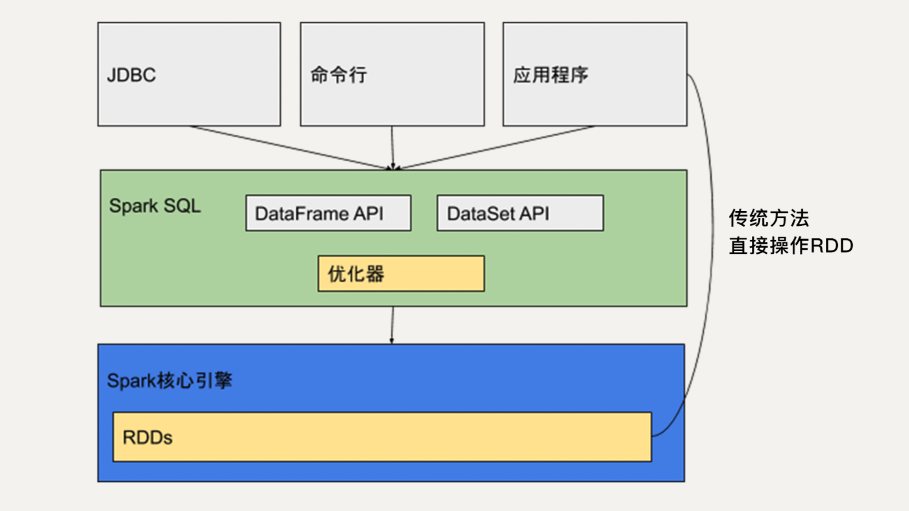
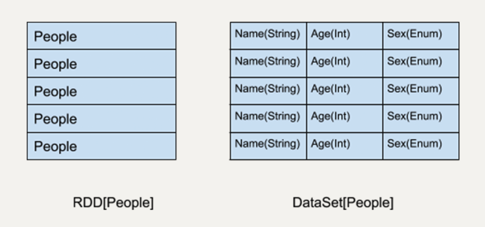
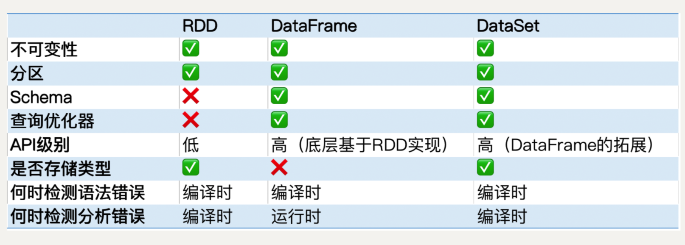
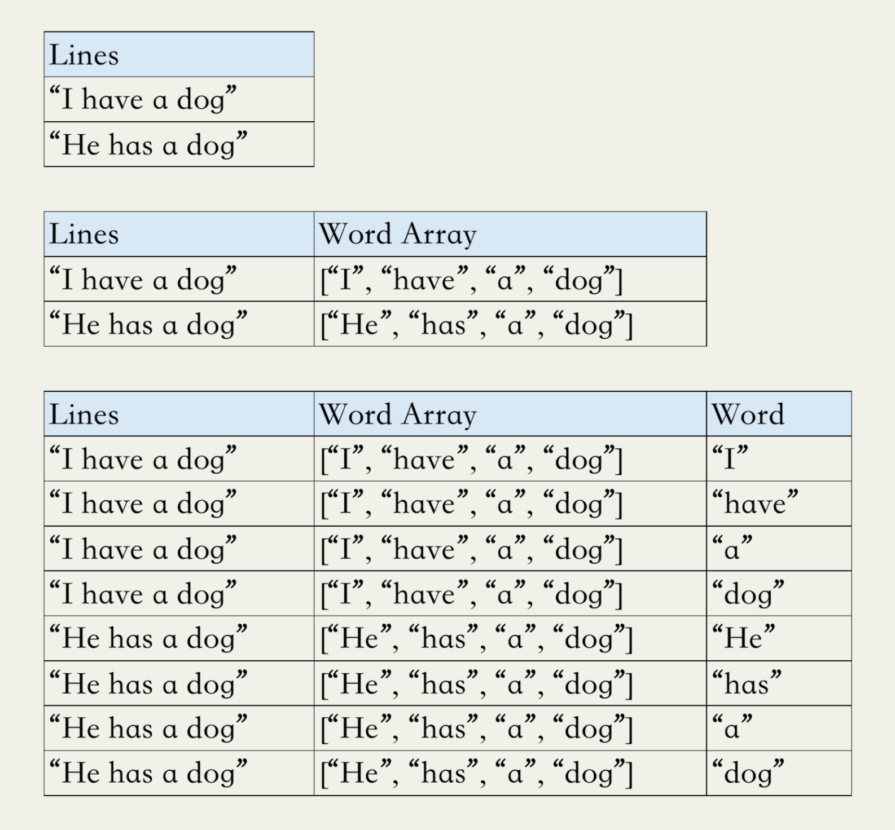

[toc]


# Spark SQL

不过在实际的开发过程中，我们并不是总需要在 RDD 的层次进行编程

SparkSQL 摒弃了 Shark 的（将 SQL 语句转化为 Spark RDD 的）执行引擎，换成自己团队重新开发的执行引擎

Spark SQL 不仅将关系型数据库的处理模式和 Spark 的函数式编程相结合，还兼容多种数据格式，包括 Hive、RDD、JSON 文件、CSV 文件等

Spark SQL 本质上是一个库。它运行在 Spark 的核心执行引擎之上

使用 Spark SQL 会让开发者觉得好像是在操作一个关系型数据库一样，而不是在操作 RDD。这是它优于原生的 RDD API 的地方。


## 特点

RDD 和 DataSet 都是类型安全的，而 DataFrame 并不是类型安全的。这是因为它不存储每一列的信息如名字和类型。

若使用 DataFrame API 时，我们可以选择一个并不存在的列，这个错误只有在代码被执行时才会抛出。如果使用 DataSet API，在编译时就会检测到这个错误

基于 DataFrame 和 DataSet API 开发出的程序会被自动优化，使得开发人员不需要操作底层的 RDD API 来进行手动优化，大大提升开发效率。

RDD API 对于非结构化的数据处理有独特的优势，比如文本流数据，而且更方便我们做底层的操作。所以在开发中，我们还是需要根据实际情况来选择使用哪种 API


## Spark SQL 架构




# 组件


## DataSet

就是数据集的意思，它是 Spark 1.6 新引入的接口

同弹性分布式数据集类似，DataSet 也是不可变分布式的数据单元，它既有与 RDD 类似的各种转换和动作函数定义，而且还享受 Spark SQL 优化过的执行引擎，使得数据搜索效率更高

DataSet 支持的转换和动作也和 RDD 类似，比如 map、filter、select、count、show 及把数据写入文件系统中

同样地，DataSet 上的转换操作也不会被立刻执行，只是先生成新的 DataSet，只有当遇到动作操作，才会把之前的转换操作一并执行，生成结果


DataSet 所描述的数据都被组织到有名字的列中，就像关系型数据库中的表一样



> 左侧的 RDD 虽然以 People 为类型参数，但 Spark 框架本身不了解 People 类的内部结构。所有的操作都以 People 为单位执行
>
> 右侧的 DataSet 却提供了详细的结构信息与每列的数据类型
>
> 这让 Spark SQL 可以清楚地知道该数据集中包含哪些列，每列的名称和类型各是什么。也就是说，DataSet 提供数据表的 schema 信息。这样的结构使得 DataSet API 的执行效率更高。


## DataFrame (Deprecated by DataSet[Row])

DataFrame 可以被看作是一种特殊的 DataSet。它也是关系型数据库中表一样的结构化存储机制，也是分布式不可变的数据结构

它的每一列并不存储类型信息，所以在编译时并不能发现类型错误。DataFrame 每一行的类型固定为 Row，他可以被当作 DataSet[Row]来处理，我们必须要通过解析才能获取各列的值

在 Spark 2.0 中，DataFrame 和 DataSet 被统一。DataFrame 作为 DataSet[Row]存在

在弱类型的语言，如 Python 中，DataFrame API 依然存在，但是在 Java 中，DataFrame API 已经不复存在了

DataFrame 是高级 API，提供类似于 SQL 的 query 接口，方便熟悉关系型数据库的开发人员使用

若DataSet 我们可以用类似 people.name 来访问一个人的名字，而对于 DataFrame 我们一定要用类似 people.get As [String] (“name”) 来访问

# RDD、DataFrame、DataSet 对比




## 场景

DataSet适用于每列类型程序都很确定时使用，而DataFrame适用于列的类型不确定，类似于generic的类型，拿到数据后根据数据类型再进行不同的处理。


# example

## DataFrame for wordCount

在 DataFrame 的世界中，我们可以把所有的词语放入一张表，表中的每一行代表一个词语，当然这个表只有一列。我们可以对这个表用一个 groupBy() 操作把所有相同的词语聚合起来，然后用 count() 来统计出每个 group 的数量

虽然 Scala 和 Java 支持对 DataFrame 进行 flatMap 操作，但是 Python 并不支持。

要用到两个新的操作explode 和 split, 把包含多个词语的句子进行分割和拆分

split 是 pyspark.sql.functions 库提供的一个函数，它作用于 DataFrame 的某一列，可以把列中的字符串按某个分隔符分割成一个字符串数组。

explode 同样是 pyspark.sql.functions 库提供的一个函数，通俗点的翻译是“爆炸”，它也作用于 DataFrame 的某一列，可以为列中的数组或者 map 中每一个元素创建一个新的 Row

DataFrame 中，每一行只有一列，每一列都是一个包含很多词语的句子，我们可以先对这一列做 split，生成一个新的列，列中每个元素是一个词语的数组；再对这个列做 explode，可以把数组中的每个元素都生成一个新的 Row。这样，就实现了类似的 flatMap 功能。




接下来我们只需要对 Word 这一列做 groupBy，就可以统计出每个词语出现的频率

```
wget https://raw.githubusercontent.com/apache/spark/master/README.md 
```


```
from pyspark.sql import SparkSession
from pyspark.sql.functions import explode
from pyspark.sql.functions import split


if __name__ == "__main__":
    # 初始化SparkSession程序入口
    spark = SparkSession.builder.appName("WordCount").getOrCreate()
    # 读入文档
    lines = spark.read.text("/tmp/README.md")
    # 针对df特定的计算格式
    words = lines.select(
        explode(
            split(lines.value, " ")
        ).alias("word")
    )
    # 返回的RDD进行计数
    wordCounts = words.groupBy("word").count()
    wordCounts.show()
    spark.stop()
    
>>>
+---------------+-----+                                                         
|           word|count|
+---------------+-----+
|     [![PySpark|    1|
|         online|    1|
|         graphs|    1|
|     ["Building|    1|
|  documentation|    3|
|       command,|    2|
|    abbreviated|    1|
|       overview|    1|
|           rich|    1|
|            set|    2|
|    -DskipTests|    1|
| 1,000,000,000:|    2|
|           name|    1|
|   ["Specifying|    1|
|         stream|    1|
|           run:|    1|
|            not|    1|
|       programs|    2|
|          tests|    2|
|./dev/run-tests|    1|
+---------------+-----+
only showing top 20 rows
```


## Batch Job (house data processing)

```
wget https://www.dcc.fc.up.pt/~ltorgo/Regression/cal_housing.tgz
```

```
pip install numpy
```


PySpark的SQL库只有DataFrame，并没有DataSet。不过在Scala和Java中，DataSet已经成为了统一的SQL入口

这是由语言特性决定的，Python是动态类型的语言，而DataSet是强类型的，要求在编译时检测类型安全。


把数据集读入 Spark

```
from pyspark.sql import SparkSession

# 初始化SparkSession和SparkContext
spark = SparkSession.builder.master("local").appName(
    "California Housing").config("spark.executor.memory", "1gb").getOrCreate()

sc = spark.sparkContext

# 读取数据并创建RDD
rdd = sc.textFile('/tmp/spark_test/CaliforniaHousing/cal_housing.data')

# 读取数据每个属性的定义并创建RDD
header = sc.textFile('/tmp/spark_test/CaliforniaHousing/cal_housing.domain')
```


把房屋信息数据和每个属性的定义读入了 Spark，并创建了两个相应的 RDD, 用 collect() 函数来把数据输出在 Shell 上

```
In [15]: header.collect()                                                                                                                                                  Out[15]: 
['longitude: continuous.',
 'latitude: continuous.',
 'housingMedianAge: continuous. ',
 'totalRooms: continuous. ',
 'totalBedrooms: continuous. ',
 'population: continuous. ',
 'households: continuous. ',
 'medianIncome: continuous. ',
 'medianHouseValue: continuous. ']
```


collect() 函数会把所有数据都加载到内存中，如果数据很大的话，有可能会造成内存泄漏，所以要小心使用。平时比较常见的方法是用 take() 函数去只读取 RDD 中的某几个元素

```
In [16]: rdd.take(2)                                                                                                                                                       Out[16]:                                                                        
['-122.230000,37.880000,41.000000,880.000000,129.000000,322.000000,126.000000,8.325200,452600.000000',
 '-122.220000,37.860000,21.000000,7099.000000,1106.000000,2401.000000,1138.000000,8.301400,358500.000000']
```


用 map 函数把大字符串分隔成数组，这会方便我们的后续操作

```

In [17]: rdd = rdd.map(lambda line: line.split(","))                                                                                                                       
In [18]: rdd.take(2)                                                                                                                                                       Out[18]: 
[['-122.230000',
  '37.880000',
  '41.000000',
  '880.000000',
  '129.000000',
  '322.000000',
  '126.000000',
  '8.325200',
  '452600.000000'],
 ['-122.220000',
  '37.860000',
  '21.000000',
  '7099.000000',
  '1106.000000',
  '2401.000000',
  '1138.000000',
  '8.301400',
  '358500.000000']]
```


Spark SQL 的 DataFrame API 在查询结构化数据时更方便使用，而且性能更好。在这个例子中你可以看到，数据的 schema 是定义好的，我们需要去查询各个列，所以 DataFrame API 显然更加适用

先把 RDD 转换为 DataFrame, 即把之前用数组代表的对象，转换成为 Row 对象，再用 toDF() 函数转换成 DataFrame

```

from pyspark.sql import Row

df = rdd.map(lambda line: Row(longitude=line[0],
                             latitude=line[1],
                             housingMedianAge=line[2],
                             totalRooms=line[3],
                             totalBedRooms=line[4],
                             population=line[5],
                             households=line[6],
                             medianIncome=line[7],
                             medianHouseValue=line[8])).toDF()
                             
df.show()

>>>
+-----------+----------------+---------+-----------+----------------+------------+-----------+-------------+-----------+
| households|housingMedianAge| latitude|  longitude|medianHouseValue|medianIncome| population|totalBedRooms| totalRooms|
+-----------+----------------+---------+-----------+----------------+------------+-----------+-------------+-----------+
| 126.000000|       41.000000|37.880000|-122.230000|   452600.000000|    8.325200| 322.000000|   129.000000| 880.000000|
|1138.000000|       21.000000|37.860000|-122.220000|   358500.000000|    8.301400|2401.000000|  1106.000000|7099.000000|
| 177.000000|       52.000000|37.850000|-122.240000|   352100.000000|    7.257400| 496.000000|   190.000000|1467.000000|
| 219.000000|       52.000000|37.850000|-122.250000|   341300.000000|    5.643100| 558.000000|   235.000000|1274.000000|
| 259.000000|       52.000000|37.850000|-122.250000|   342200.000000|    3.846200| 565.000000|   280.000000|1627.000000|
| 193.000000|       52.000000|37.850000|-122.250000|   269700.000000|    4.036800| 413.000000|   213.000000| 919.000000|
| 514.000000|       52.000000|37.840000|-122.250000|   299200.000000|    3.659100|1094.000000|   489.000000|2535.000000|
| 647.000000|       52.000000|37.840000|-122.250000|   241400.000000|    3.120000|1157.000000|   687.000000|3104.000000|
| 595.000000|       42.000000|37.840000|-122.260000|   226700.000000|    2.080400|1206.000000|   665.000000|2555.000000|
| 714.000000|       52.000000|37.840000|-122.250000|   261100.000000|    3.691200|1551.000000|   707.000000|3549.000000|
| 402.000000|       52.000000|37.850000|-122.260000|   281500.000000|    3.203100| 910.000000|   434.000000|2202.000000|
| 734.000000|       52.000000|37.850000|-122.260000|   241800.000000|    3.270500|1504.000000|   752.000000|3503.000000|
| 468.000000|       52.000000|37.850000|-122.260000|   213500.000000|    3.075000|1098.000000|   474.000000|2491.000000|
| 174.000000|       52.000000|37.840000|-122.260000|   191300.000000|    2.673600| 345.000000|   191.000000| 696.000000|
| 620.000000|       52.000000|37.850000|-122.260000|   159200.000000|    1.916700|1212.000000|   626.000000|2643.000000|
| 264.000000|       50.000000|37.850000|-122.260000|   140000.000000|    2.125000| 697.000000|   283.000000|1120.000000|
| 331.000000|       52.000000|37.850000|-122.270000|   152500.000000|    2.775000| 793.000000|   347.000000|1966.000000|
| 303.000000|       52.000000|37.850000|-122.270000|   155500.000000|    2.120200| 648.000000|   293.000000|1228.000000|
| 419.000000|       50.000000|37.840000|-122.260000|   158700.000000|    1.991100| 990.000000|   455.000000|2239.000000|
| 275.000000|       52.000000|37.840000|-122.270000|   162900.000000|    2.603300| 690.000000|   298.000000|1503.000000|
+-----------+----------------+---------+-----------+----------------+------------+-----------+-------------+-----------+
only showing top 20 rows
```


这里每一列的数据格式都是 string，但是，它们其实都是数字，所以我们可以通过 cast() 函数把每一列的类型转换成 float

```
from pyspark.sql.types import FloatType

def convertColumn(df, names, newType):
    for name in names:
        df = df.withColumn(name, df[name].cast(newType))
    return df

columns = ['households', 'housingMedianAge', 'latitude', 'longitude', 'medianHouseValue', 'medianIncome', 'population', 'totalBedRooms', 'totalRooms']

df = convertColumn(df, columns, FloatType())
```

```
In [28]: df.describe                                                                                                                                                       Out[28]: <bound method DataFrame.describe of DataFrame[households: float, housingMedianAge: float, latitude: float, longitude: float, medianHouseValue: float, medianIncome: float, population: float, totalBedRooms: float, totalRooms: float]>
```

```

In [27]: df.show(5)                                                                                                                                                        +----------+----------------+--------+---------+----------------+------------+----------+-------------+----------+
|households|housingMedianAge|latitude|longitude|medianHouseValue|medianIncome|population|totalBedRooms|totalRooms|
+----------+----------------+--------+---------+----------------+------------+----------+-------------+----------+
|     126.0|            41.0|   37.88|  -122.23|        452600.0|      8.3252|     322.0|        129.0|     880.0|
|    1138.0|            21.0|   37.86|  -122.22|        358500.0|      8.3014|    2401.0|       1106.0|    7099.0|
|     177.0|            52.0|   37.85|  -122.24|        352100.0|      7.2574|     496.0|        190.0|    1467.0|
|     219.0|            52.0|   37.85|  -122.25|        341300.0|      5.6431|     558.0|        235.0|    1274.0|
|     259.0|            52.0|   37.85|  -122.25|        342200.0|      3.8462|     565.0|        280.0|    1627.0|
+----------+----------------+--------+---------+----------------+------------+----------+-------------+----------+
only showing top 5 rows
```


转换成数字有很多优势。比如，我们可以按某一列，对所有对象进行排序，也可以计算平均值等

统计出所有建造年限各有多少个房子

```

In [29]: df.groupBy("housingMedianAge").count().sort("housingMedianAge",ascending=False).show()                                                                            +----------------+-----+                                                        
|housingMedianAge|count|
+----------------+-----+
|            52.0| 1273|
|            51.0|   48|
|            50.0|  136|
|            49.0|  134|
|            48.0|  177|
|            47.0|  198|
|            46.0|  245|
|            45.0|  294|
|            44.0|  356|
|            43.0|  353|
|            42.0|  368|
|            41.0|  296|
|            40.0|  304|
|            39.0|  369|
|            38.0|  394|
|            37.0|  537|
|            36.0|  862|
|            35.0|  824|
|            34.0|  689|
|            33.0|  615|
+----------------+-----+
only showing top 20 rows
```


### 预处理

通过上面的数据分析，你可能会发现这些数据还是不够直观

1. 房价的值普遍都很大，我们可以把它调整成相对较小的数字；

大多数房价都是十万起的，所以可以用 withColumn() 函数把所有房价都除以 100000

```
from pyspark.sql.functions import col                                                                                                                             
df = df.withColumn('medianHouseValue', col('medianHouseValue')/100000)                                                                                            

In [33]: df.show(2)                                                                                                                                                        +----------+----------------+--------+---------+----------------+------------+----------+-------------+----------+
|households|housingMedianAge|latitude|longitude|medianHouseValue|medianIncome|population|totalBedRooms|totalRooms|
+----------+----------------+--------+---------+----------------+------------+----------+-------------+----------+
|     126.0|            41.0|   37.88|  -122.23|           4.526|      8.3252|     322.0|        129.0|     880.0|
|    1138.0|            21.0|   37.86|  -122.22|           3.585|      8.3014|    2401.0|       1106.0|    7099.0|
+----------+----------------+--------+---------+----------------+------------+----------+-------------+----------+
only showing top 2 rows
```


2. 有的属性没什么意义，比如所有房子的总房间数和总卧室数，我们更加关心的是平均房间数；

添加三个新的列：

每个家庭的平均房间数：roomsPerHousehold 

每个家庭的平均人数：populationPerHousehold

卧室在总房间的占比：bedroomsPerRoom

```
df = df.withColumn("roomsPerHousehold", col("totalRooms")/col("households")).\
    withColumn("populationPerHousehold", col("population")/col("households")).\
    withColumn("bedroomsPerRoom", col("totalBedRooms")/col("totalRooms"))
    

In [35]: df.show(3)                                                                                                                                                        +----------+----------------+--------+---------+----------------+------------+----------+-------------+----------+-----------------+----------------------+-------------------+
|households|housingMedianAge|latitude|longitude|medianHouseValue|medianIncome|population|totalBedRooms|totalRooms|roomsPerHousehold|populationPerHousehold|    bedroomsPerRoom|
+----------+----------------+--------+---------+----------------+------------+----------+-------------+----------+-----------------+----------------------+-------------------+
|     126.0|            41.0|   37.88|  -122.23|           4.526|      8.3252|     322.0|        129.0|     880.0|6.984126984126984|    2.5555555555555554|0.14659090909090908|
|    1138.0|            21.0|   37.86|  -122.22|           3.585|      8.3014|    2401.0|       1106.0|    7099.0|6.238137082601054|     2.109841827768014|0.15579659106916466|
|     177.0|            52.0|   37.85|  -122.24|           3.521|      7.2574|     496.0|        190.0|    1467.0|8.288135593220339|    2.8022598870056497|0.12951601908657123|
+----------+----------------+--------+---------+----------------+------------+----------+-------------+----------+-----------------+----------------------+-------------------+
only showing top 3 rows    
```


有的列是我们并不关心的，比如经纬度，这个数值很难有线性的意义。所以我们可以只留下重要的信息列

```
df = df.select("medianHouseValue",
               "totalBedRooms",
               "population",
               "households",
               "medianIncome",
               "roomsPerHousehold",
               "populationPerHousehold",
               "bedroomsPerRoom")
               

In [37]: df.show(3)                                                                                                                                                        +----------------+-------------+----------+----------+------------+-----------------+----------------------+-------------------+
|medianHouseValue|totalBedRooms|population|households|medianIncome|roomsPerHousehold|populationPerHousehold|    bedroomsPerRoom|
+----------------+-------------+----------+----------+------------+-----------------+----------------------+-------------------+
|           4.526|        129.0|     322.0|     126.0|      8.3252|6.984126984126984|    2.5555555555555554|0.14659090909090908|
|           3.585|       1106.0|    2401.0|    1138.0|      8.3014|6.238137082601054|     2.109841827768014|0.15579659106916466|
|           3.521|        190.0|     496.0|     177.0|      7.2574|8.288135593220339|    2.8022598870056497|0.12951601908657123|
+----------------+-------------+----------+----------+------------+-----------------+----------------------+-------------------+
only showing top 3 rows             
```


3. 在我们想要构建的线性模型中，房价是结果，其他属性是输入参数。所以我们需要把它们分离处理；

把 DataFrame 转换成 RDD，然后用 map() 函数把每个对象分成两部分：房价和一个包含其余属性的列表，然后再转换回 DataFrame

两部分重新标记为“label”和“features”，label 代表的是房价，features 代表包括其余参数的列表

```
from pyspark.ml.linalg import DenseVector

input_data = df.rdd.map(lambda x: (x[0], DenseVector(x[1:])))
df_ = spark.createDataFrame(input_data, ["label", "features"])


In [17]: df_.show(3)                                                                                                                                                       +-----+--------------------+                                                    
|label|            features|
+-----+--------------------+
|4.526|[129.0,322.0,126....|
|3.585|[1106.0,2401.0,11...|
|3.521|[190.0,496.0,177....|
+-----+--------------------+
only showing top 3 rows
```


```
In [18]: df.take(2)                                                                                                                                                        Out[18]: 
[Row(medianHouseValue=4.526, totalBedRooms=129.0, population=322.0, households=126.0, medianIncome=8.325200080871582, roomsPerHousehold=6.984126984126984, populationPerHousehold=2.5555555555555554, bedroomsPerRoom=0.14659090909090908),
 Row(medianHouseValue=3.585, totalBedRooms=1106.0, population=2401.0, households=1138.0, medianIncome=8.301400184631348, roomsPerHousehold=6.238137082601054, populationPerHousehold=2.109841827768014, bedroomsPerRoom=0.15579659106916466)]
```


4. 有的属性最小值和最大值范围很大，我们可以把它们标准化处理。

数据的标准化我们可以借助 Spark 的机器学习库 Spark ML 来完成。Spark ML 也是基于 DataFrame，它提供了大量机器学习的算法实现、数据流水线（pipeline）相关工具和很多常用功能

新增了一个 features_scaled 的列，它里面每个数据都是标准化过的，我们应该用它，而非 features 来训练模型

```
from pyspark.ml.feature import StandardScaler

standardScaler = StandardScaler(inputCol="features", outputCol="features_scaled")
scaler = standardScaler.fit(df_)
scaled_df = scaler.transform(df_)


In [20]: scaled_df.show(2)                                                                                                                                                 +-----+--------------------+--------------------+                               
|label|            features|     features_scaled|
+-----+--------------------+--------------------+
|4.526|[129.0,322.0,126....|[0.30623297630686...|
|3.585|[1106.0,2401.0,11...|[2.62553233949917...|
+-----+--------------------+--------------------+
only showing top 2 rows


In [21]: scaled_df.take(2)                                                                                                                                                 Out[21]: 
[Row(label=4.526, features=DenseVector([129.0, 322.0, 126.0, 8.3252, 6.9841, 2.5556, 0.1466]), features_scaled=DenseVector([0.3062, 0.2843, 0.3296, 4.3821, 2.8228, 0.2461, 2.5264])),
 Row(label=3.585, features=DenseVector([1106.0, 2401.0, 1138.0, 8.3014, 6.2381, 2.1098, 0.1558]), features_scaled=DenseVector([2.6255, 2.1202, 2.9765, 4.3696, 2.5213, 0.2031, 2.6851]))]
```


### 创建模型

完成预处理，开始构建线性回归模型

把数据集分为训练集和测试集，训练集用来训练模型，测试集用来评估模型的正确性

DataFrame 的 randomSplit() 函数可以很容易的随机分割数据，这里我们将 80% 的数据用于训练，剩下 20% 作为测试集

```
In [22]: train_data, test_data = scaled_df.randomSplit([.8, .2], seed=123)                                                                                                 
In [23]: train_data.show(2)                                                                                                                                                +-------+--------------------+--------------------+                             
|  label|            features|     features_scaled|
+-------+--------------------+--------------------+
|0.14999|[73.0,85.0,38.0,1...|[0.17329463000311...|
|  0.225|[73.0,216.0,63.0,...|[0.17329463000311...|
+-------+--------------------+--------------------+
only showing top 2 rows


In [24]: df.count(), train_data.count(), test_data.count()                                                                                                                 Out[24]: (20640, 16490, 4150)  
```


用 Spark ML 提供的 LinearRegression 功能，我们可以很容易得构建一个线性回归模型

```
from pyspark.ml.regression import LinearRegression

lr = LinearRegression(featuresCol='features_scaled', labelCol="label",
                      maxIter=10, regParam=0.3, elasticNetParam=0.8)
linearModel = lr.fit(train_data)
```


### 模型评估

用 linearModel 的 transform() 函数来预测测试集中的房价，并与真实情况进行对比

用 RDD 的 zip() 函数把预测值和真实值放在一起，这样可以方便地进行比较。比如让我们看一下前两个对比结果

```
predicted = linearModel.transform(test_data)
predictions = predicted.select('prediction').rdd.map(lambda x: x[0])
labels = predicted.select('label').rdd.map(lambda x: x[0])
predictionAndLabel = predictions.zip(labels).collect()


In [27]: predicted.show(5)                                                                                                                                                 +-------+--------------------+--------------------+------------------+          
|  label|            features|     features_scaled|        prediction|
+-------+--------------------+--------------------+------------------+
|0.14999|[239.0,490.0,164....|[0.56736187083210...|1.5774952857305953|
|0.14999|[267.0,628.0,225....|[0.63383104398397...|  2.16066705987466|
|  0.175|[168.0,259.0,138....|[0.39881503891126...|1.6517987034312944|
|    0.3|[183.0,500.0,177....|[0.43442352452834...|1.7276344592008637|
|  0.325|[49.0,51.0,20.0,4...|[0.11632105301578...|2.1126359101532257|
+-------+--------------------+--------------------+------------------+
only showing top 5 rows
```


```

In [31]: predictionAndLabel[900: 905]                                                                                                                                      Out[31]: 
[(1.4103335361084612, 1.625),
 (1.3338291551275154, 1.625),
 (2.0351285249310935, 1.627),
 (2.119015947064881, 1.628),
 (1.5197966364548035, 1.631)]
```


我们的模型预测的结果有些偏小，这可能有多个因素造成。最直接的原因就是房价与我们挑选的列并没有强线性关系，而且我们使用的参数也可能不够准确


## Streaming Job 