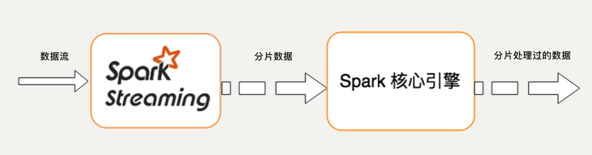
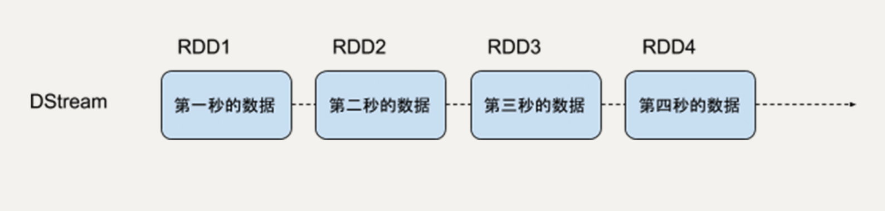
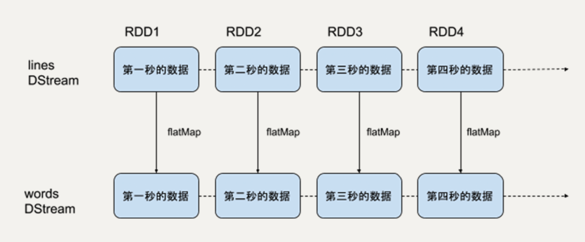
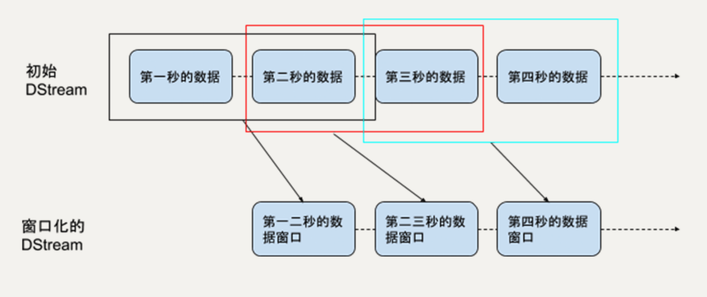
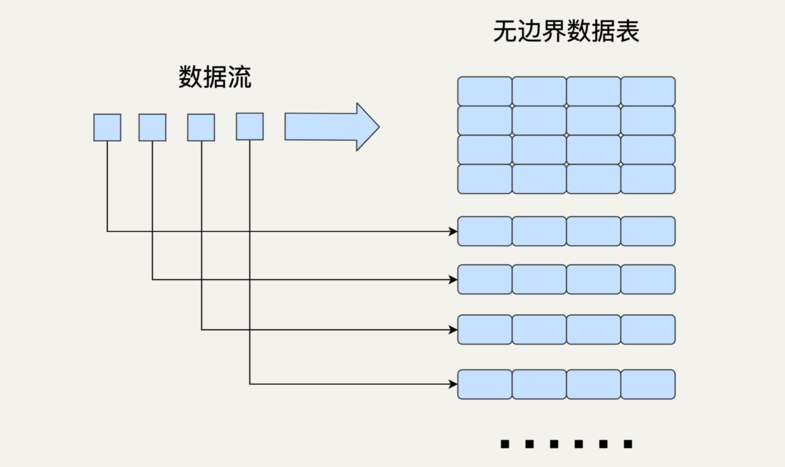

[toc]


# Spark Streaming

Spark Streaming 的原理与微积分的思想很类似

微分就是无限细分，积分就是对无限细分的每一段进行求和。它本质上把一个连续的问题转换成了无限个离散的问题

流处理的数据是一系列连续不断变化，且无边界的。我们永远无法预测下一秒的数据是什么样。Spark Streaming 用时间片拆分了无限的数据流，然后对每一个数据片用类似于批处理的方法进行处理，输出的数据也是一块一块的。




Spark Streaming 提供一个对于流数据的抽象 DStream。DStream 可以由来自 Apache Kafka、Flume 或者 HDFS 的流数据生成，也可以由别的 DStream 经过各种转换操作得来

底层 DStream 也是由很多个序列化的 RDD 构成，按时间片（比如一秒）切分成的每个数据单位都是一个 RDD。然后，Spark 核心引擎将对 DStream 的 Transformation 操作变为针对 Spark 中对 RDD 的 Transformation 操作，将 RDD 经过操作变成中间结果保存在内存中。

之前的 DataFrame 和 DataSet 也是同样基于 RDD，所以说 RDD 是 Spark 最基本的数据抽象。就像 Java 里的基本数据类型（Primitive Type）一样，所有的数据都可以用基本数据类型描述。也正是因为这样，无论是 DataFrame，还是 DStream，都具有 RDD 的不可变性、分区性和容错性等特质

所以，Spark 是一个高度统一的平台，所有的高级 API 都有相同的性质，它们之间可以很容易地相互转化。Spark 的野心就是用这一套工具统一所有数据处理的场景。由于 Spark Streaming 将底层的细节封装起来了，所以对于开发者来说，只需要操作 DStream 就行


## 优点

由于它的底层是基于 RDD 实现的，所以 RDD 的优良特性在它这里都有体现

数据容错性，如果 RDD 的某些分区丢失了，可以通过依赖信息重新计算恢复

DStream 同样也能通过 persist() 方法将数据流存放在内存中。这样做的好处是遇到需要多次迭代计算的程序时，速度优势十分明显

Spark Streaming 是 Spark 生态的一部分。所以，它可以和 Spark 的核心引擎、Spark SQL、MLlib 等无缝衔接。换句话说，对实时处理出来的中间数据，我们可以立即在程序中无缝进行批处理、交互式查询等操作。这个特点大大增强了 Spark Streaming 的优势和功能，使得基于 Spark Streaming 的应用程序很容易扩展


## 缺点

实时计算延迟较高，一般在秒的级别。这是由于 Spark Streaming 不支持太小的批处理的时间间隔

无疑 Spark Streaming 是一个准实时系统。别的流处理框架，如 Storm 的延迟性就好很多，可以做到毫秒级


## DStream

DStream是一个连续的 RDD 序列，每一个 RDD 代表一个时间窗口的输入数据流




创建一个 lines 的 DStream，去监听来自本机 9999 端口的数据流，每一个数据代表一行文本。然后，对 lines 进行 flatMap 的转换操作，把每一个文本行拆分成词语。

```
sc = SparkContext(master, appName)
ssc = StreamingContext(sc, 1)
lines = sc.socketTextStream("localhost", 9999)
words = lines.flatMap(lambda line: line.split(" "))
```

> 对一个 DStream 进行 flatMap 操作，就是对它里边的每一个 RDD 进行 flatMap 操作，生成了一系列新的 RDD，构成了一个新的代表词语的 DStream




### 滑动窗口操作

因为 DStream 和 RDD 的关系，RDD 支持的所有转换操作，DStream 都支持，比如 map、flatMap、filter、union 等

任何 Spark Streaming 的程序都要首先创建一个 StreamingContext 的对象，它是所有 Streaming 操作的入口。

StreamingContext 中最重要的参数是批处理的时间间隔，即把流数据细分成数据块的粒度

这个时间间隔决定了流处理的延迟性，所以，需要我们根据需求和资源来权衡间隔的长度。


#### 滑动窗口参数

窗口长度（window length）：每次统计的数据的时间跨度，在例子中是 60 秒；

滑动间隔（sliding interval）：每次统计的时间间隔，在例子中是 10 秒。


由于 Spark Streaming 流处理的最小时间单位就是 StreamingContext 的时间间隔，所以这两个参数一定是它的整数倍




最基本的滑动窗口操作是 window，它可以返回一个新的 DStream，这个 DStream 中每个 RDD 代表一段时间窗口内的数据


```
windowed_words = words.window(60, 10)
```

> windowed_words 代表的就是热词统计例子中我们所需的 DStream，
>
> 即它里边每一个数据块都包含过去 60 秒内的词语，而且这样的块每 10 秒钟就会生成一个


#### 进阶窗口操作

如 countByWindow、reduceByWindow、reduceByKeyAndWindow 和 countByValueAndWindow


# Structured Streaming （更好的选择）

Structured Streaming 是基于 Spark SQL 引擎实现的，依靠 Structured Streaming，在开发者眼里，流数据和静态数据没有区别。我们完全可以像批处理静态数据那样去处理流数据。随着流数据的持续输入，Spark SQL 引擎会帮助我们持续地处理新数据，并且更新计算结果。


## 特点

Structured Streaming 提供的 DataFrame API 就是这么一个相对高 level 的 API，大部分开发者都很熟悉关系型数据库和 SQL。这样的数据抽象可以让他们用一套统一的方案去处理批处理和流处理，不用去关心具体的执行细节。即免去了编写 Spark Streaming 程序的时候，本质上就是要去构造 RDD 的 DAG 执行图，然后通过 Spark Engine 运行。这样开发者身上的担子就很重，很多时候要自己想办法去提高程序的处理效率。

DataFrame API 是在 Spark SQL 的引擎上执行的，Spark SQL 有非常多的优化功能，比如执行计划优化和内存管理等，所以 Structured Streaming 的应用程序性能很好

在 Spark 2.3 版本中，Structured Streaming 引入了连续处理的模式，可以做到真正的毫秒级延迟，这无疑大大拓展了 Structured Streaming 的应用广度。不过现在连续处理模式还有很多限制，让我们期待它的未来吧。


## Structured Streaming 模型

在 Structured Streaming 的模型中，我们要把数据看成一个无边界的关系型的数据表。每一个数据都是表中的一行，不断会有新的数据行被添加到表里来。我们可以对这个表做任何类似批处理的查询，Spark 会帮我们不断对新加入的数据进行处理，并更新计算结果




与 Spark Streaming 类似，Structured Streaming 也是将输入的数据流按照时间间隔（以一秒为例）划分成数据段。每一秒都会把新输入的数据添加到表中，Spark 也会每秒更新输出结果。输出结果也是表的形式，输出表可以写入硬盘或者 HDFS


## 输出模式

完全模式（Complete Mode）：整个更新过的输出表都被写入外部存储；

附加模式（Append Mode）：上一次触发之后新增加的行才会被写入外部存储。如果老数据有改动则不适合这个模式；

更新模式（Update Mode）：上一次触发之后被更新的行才会被写入外部存储。

需要注意的是，Structured Streaming 并不会完全存储输入数据。每个时间间隔它都会读取最新的输入，进行处理，更新输出表，然后把这次的输入删除。Structured Streaming 只会存储更新输出表所需要的信息


## Streaming DataFrame API

在 Structured Streaming 发布以后，DataFrame 既可以代表静态的有边界数据，也可以代表无边界数据。之前对静态 DataFrame 的各种操作同样也适用于流式 DataFrame。


### create DataFrame

SparkSession.readStream() 返回的 DataStreamReader 可以用于创建流 DataFrame。它支持多种类型的数据流作为输入，比如文件、Kafka、socket 等

```
socketDataFrame = spark
   .readStream
   .format("socket"）
   .option("host", "localhost")
   .option("port", 9999)
   .load()
```

> 创建了一个 DataFrame，用来监听来自 localhost:9999 的数据流


### 基本的查询操作

流 DataFrame 同静态 DataFrame 一样，不仅支持类似 SQL 的查询操作（如 select 和 where 等），还支持 RDD 的转换操作（如 map 和 filter）

假设我们已经有一个 DataFrame 代表一个学生的数据流，即每个数据是一个学生，每个学生有名字（name）、年龄（age）、身高（height）和年级（grade）四个属性，我们可以用 DataFrame API 去做类似于 SQL 的 Query

```
df = … // 这个DataFrame代表学校学生的数据流，schema是{name: string, age: number, height: number, grade: string}
df.select("name").where("age > 10") // 返回年龄大于10岁的学生名字列表
df.groupBy("grade").count() // 返回每个年级学生的人数
df.sort_values([‘age’], ascending=False).head(100) //返回100个年龄最大的学生 
df.isStreaming()  //判断一个 DataFrame 是否代表流数据
```


```
words = ...  #这个DataFrame代表词语的数据流，schema是 { timestamp: Timestamp, word: String}


windowedCounts = words.groupBy(
   window(words.timestamp, "1 minute", "10 seconds"),
   words.word
).count()
.sort(desc("count"))
.limit(10)
```

> 创建了一个窗口长度为 1 分钟，滑动间隔为 10 秒的 window
>
> 把输入的词语表根据 window 和词语本身聚合起来，并统计每个 window 内每个词语的数量。之后，再根据词语的数量进行排序，只返回前 10 的词语。
>
> 在 Structured Streaming 基于时间窗口的聚合操作中，groupBy 是非常常用的


### 输出结果流

对输入数据流的处理，并且持续输出结果

用 Dataset.writeStream() 返回的 DataStreamWriter 对象去输出结果。它支持多种写入位置，如硬盘文件、Kafka、console 和内存等

```
query = wordCounts
   .writeStream
   .outputMode("complete")
   .format("csv")
   .option("path", "path/to/destination/dir")
   .start()


query.awaitTermination()
```

> 选择了完全模式，把输出结果流写入了 CSV 文件


