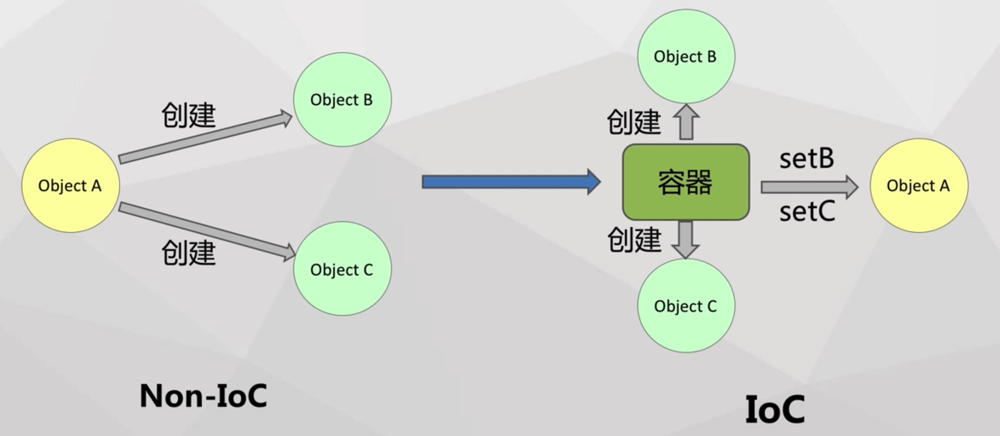
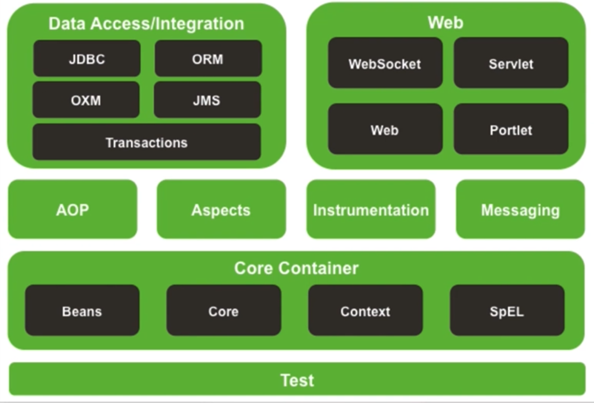
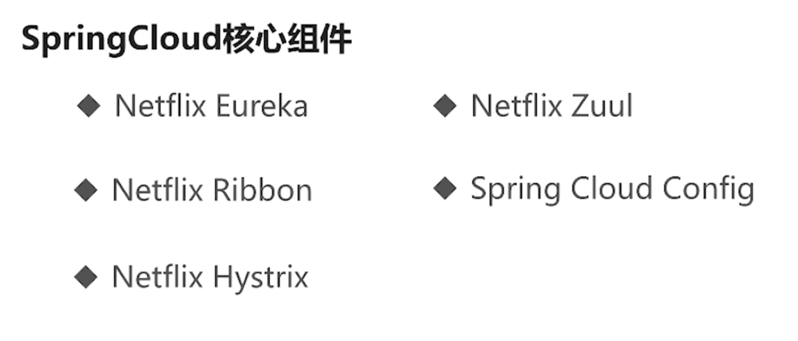
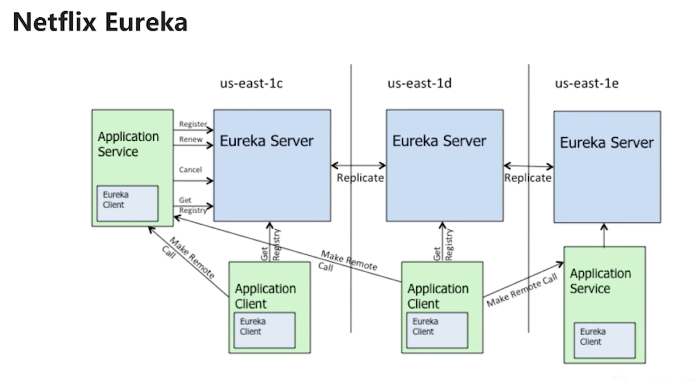
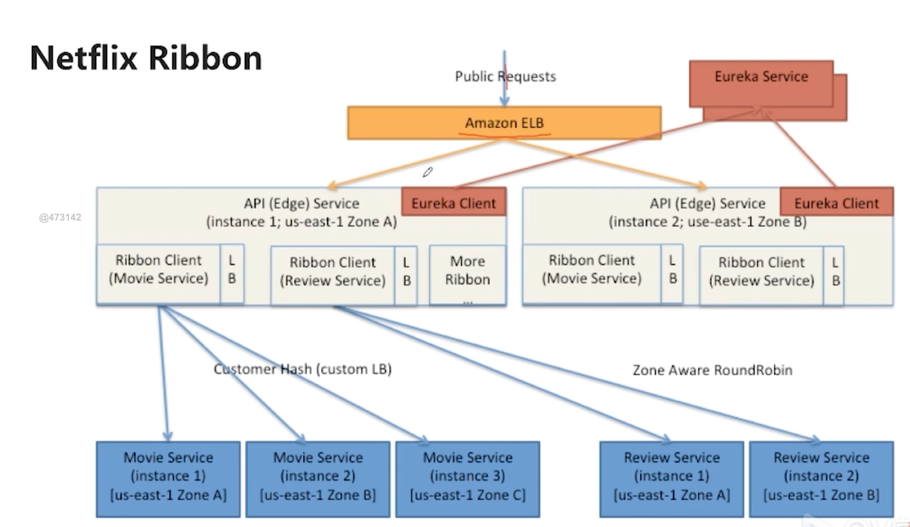
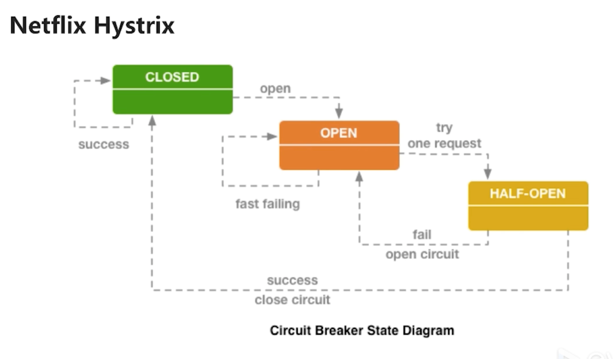
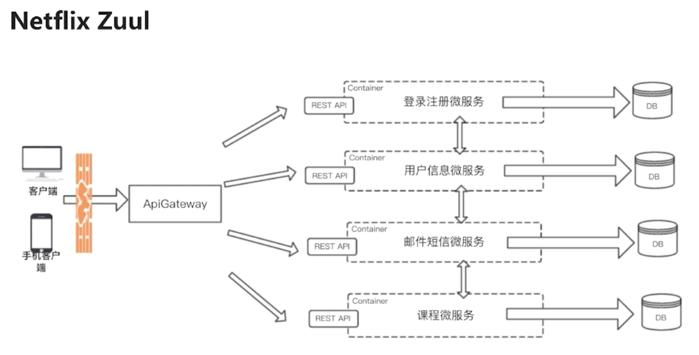

[toc]

# Spring

轻量级，一站式，开发框架

Spring自身也提供了表述层的SpringMVC和持久层的Spring JDBC


## 核心技术

IoC 控制反转 Inversion of Control

AOP 面向切面编程 Aspect-Oriented Programming 


### IoC  反转控制

Inversion of Control 容器框架 

颠覆了应用程序组件获取资源的传统方式，即由容器主动的向资源推送给需要的组件，而不是组件去容器中获取。

开发人员只需要提供接受资源的方式即可，也称为查找的被动形式




#### DI 依赖注入

IoC 的另一种表达方式，即组件以一些预先定义好的方式接受来自容器的资源注入

DI是对IoC思想的具体实现


#### Bean

让IoC容器管理一个具体对象

需要用id作为唯一标示

class 类通过反射方式创建对象

```
Class cls = Class.forName("com.xurick.spring.helloworld.Person");
Object obj = cls.newInstance(); //无参数构造器
```

property gei对象的属性赋值


获取Bean，除了可以通过id，还可以通过类型，即同一个类型的bean再XML中配置多个，会抛出异常，同一个类型的bean在容器中必须唯一

```
HelloWorld helloworld = ctx.getBean(HelloWorld.class);
```

另一种方式是重载方法，同时指向bean的id值和类型

```
HelloWorld helloworld = ctx.getBean("helloWorld", HelloWorld.class);
```


### AOP

业务逻辑与非业务逻辑分离


## Spring模块

Core Container 下是核心模块




# SpringCloud

意在简化分布式，是功能的集合，风格的统一    




## Euerka




## Ribbon




## Hystrix




 

## Zuul




# SpringBoot

意在简化，是一种开发，配置风格


