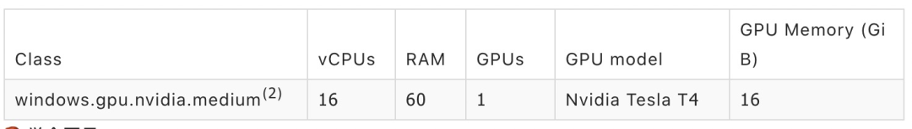

[toc]


# circleci


## 特点

通过workflows编排强大的控制执行能力

一流的docker支持（支持运行任意的公共或私服docker仓库、通过executor自定义编排到job中、支持layer缓存等等）

支持自定义CPU/RAM

无论什么语言都可运行

强大的缓存能力

通过ssh或者本地build可以非常简单上手的debug

强大的安全保障

丰富的CI/CD数据视图


## hello world

通过workfows编排任务，并且内置了多种功能强大的step，包括run（自定义脚本）、checkout（下载代码）、save_cache／restore_cache（保存和恢复缓存）、store_artifacts／store_test_results（产物存储）等多种能力。

```
version: 2
jobs:
  build:
    #1.定义运行的环境,这里是包含jdk8的一个image
    docker:
      - image: circleci/openjdk:8-jdk

    #2.设置step共享的工作目录(step脚本相对这个目录执行)
    working_directory: ~/circleci-demo

        #3.定义job级别的环境变量,所有step共享
    environment:
      JVM_OPTS: -Xmx3200m
      MVN_ARGS: -Dmaven.repo.local=.repo

        #4.steps
    steps:
        #4.1 下载代码
      - checkout

      #4.2 拉取maven缓存
      - restore_cache:
          keys:
              # cachae key, 仅当pom.xml文件的校验和和上次一样（也就是没有变更）才会更新
            - v1-dependencies-{{ checksum "pom.xml" }} #
            # 如果上面的key失效用这个key代替
            - v1-dependencies-

            #4.3 打包
      - run: mvn clean install package ${MVN_ARGS}

            #4.4 上传缓存
      - save_cache:
              #缓存目录
          paths:
            -  .repo
          #换粗key，仅当pom.xml发生变更才更新
          key: v1-dependencies-{{ checksum "pom.xml" }}

          #4.5 上传产物(编译jar)
      - store_artifacts:
          path: target/
          destination: circleci-demo-jar

            #4.6 将workspace临时存储下来，供workflow下的其他job复用
      - persist_to_workspace:
          root: ~/
          paths:
            - circleci-demo
            
            
            
version: 2
jobs:
  test:
      #1.定义运行的环境,这里是包含jdk8的一个image
    docker:
      - image: circleci/openjdk:8-jdk
    #2.设置step共享的工作目录(step脚本相对这个目录执行)
    working_directory: ~/circleci-demo

        #3.定义job级别的环境变量,所有step共享
    environment:
      JVM_OPTS: -Xmx3200m
      MVN_ARGS: -Dmaven.repo.local=.repo

        #4.steps
    steps:
      #4.1 将build临时保留的workspace恢复到job中
      - attach_workspace:
          at: ~/circleci-demo

            #4.2执行mvn test测试脚本
      - run: | 
          cd circleci-demo
          mvn clean test ${MVN_ARGS}
            #4.3 上传测试产物
      - store_test_results:
          path: circleci-demo/target/surefire-reports


version: 2
jobs:       
  deploy-site1:
    docker:
      - image: circleci/openjdk:8-jdk 
    steps:
      - run: echo 'deploy sit1'
  deploy-site2:
    docker:
      - image: circleci/openjdk:8-jdk 
    steps:
      - run: echo 'deploy sit2' 


version: 2
workflows:
  #1. workflow版本
  version: 2
  #2. workflow 名称
  circleci-demo-workflow:
    #2.1 jobs
    jobs:
      #2.1.1 build job，仅在master分支触发
      - build:
          filters:
            branches:
              only: master

      #2.1.2 build job，仅在master分支触发,依赖build job
      - test:
          requires:
            - build

      #2.1.3 手动确认job，依赖test job
      - approval-deploy:
          type: approval
          requires:
            - test
      #2.1.4 发布job，依赖approval-deploy job, 和deploy-site2并发执行
      - deploy-site1:
          requires:
            - approval-deploy
          filters:
            branches:
              only: master

      #2.1.5 发布job，依赖approval-deploy job, 和deploy-site1并发执行
      - deploy-site2:
          requires:
            - approval-deploy
          filters:
            branches:
              only: master      
```


# 组件


## Executors 执行器

CircleCI设计了executors，支持将job调度到不同类型的执行器上，包括Docker、Linux、Mac、GPU等等


| executor | 备注                  |
| -------- | --------------------- |
| docker   | 通过image执行镜像     |
| machine  | 包括linux、unbuntu等  |
| macos    | macos，支持指定os版本 |
| windows  | 通过虚拟机运行        |


* 运行在ubuntu上

```
version: 2.1
jobs:
  build:
    machine:
      image: ubuntu-1604:201903-01
    steps:
      - checkout
      - run:
          name: "Testing"
          command: echo "Hi"
```


* 运行在mac上

```
jobs:
  build:
    macos:
      xcode: "11.3.0"
```


## orbs 集成能力

orb是一个可重用的YAML配置包，它将重复的配置压缩成一行代码，包含了jobs、command、executors等等的一个大集合，通过orbs集成了非常丰富（nb）的工具链，集成方包括：AWS、 Azure、ConfigCat、Docker Hub、Google Cloud、Helm等等。

```
version: 2.1
orbs:
    #这里的hello是orbs的一个引用, hello等价于circleci/hello-build@0.0.5
    hello: circleci/hello-build@0.0.5
workflows:
    "Hello Workflow":
        jobs:
           #hello等价于circleci/hello-build@0.0.5，hello-build是它的一个job
          - hello/hello-build 
```


# Yaml

yaml本质是一个map，CircleCI yaml中包含了非常多的key-value对象

yaml语法：根key、jobs key、steps key，它们至今依次是上下级的关系

circleci的yaml文件存储位置(相对代码根目录)：.circleci/config.yml

```
代码根目录
├── .circleci
│   └── config.yml
```


## version

定义pipeline的yaml版本，用于发出弃用或破坏更改的警告


## orbs (require 2.1)

orb是一个可重用的YAML配置包，它将重复的配置压缩成一行代码
    可以帮助自动化重复的过程，加速项目设置，并使其易于与第三方工具集成

orbs是一个集合的大招了，它是包含了jobs、commands、executors甚至以后还会扩展更多的整体集合

orgs仓库，https://circleci.com/orbs/registry/


## commands (require 2.1)

commands其实就是一堆step的集合，主要作用就是让多个step合并成一个，并在job中可以直接调用，有点封装的意思

commands内主要包含了三个key：

| Key         | Required | Type     | Description                     |
| ----------- | -------- | -------- | ------------------------------- |
| steps       | Y        | Sequence | 在调用job时运行的一系列step集合 |
| parameters  | N        | Map      | 参数，一个map集合               |
| description | N        | String   | command描述                     |


```
version: 2.1
commands:
  sayhello: #一个command其实就是包含一个或多个step的集合，这个值会作为key在jobs中使用
    description: "A very simple command for demonstration purposes"
    parameters:
      to:
        type: string
        default: "Hello World"
    steps:
      - run: echo << parameters.to >>
      - run: echo haha
jobs:
    hello-job:
      steps:
        - run: sayhello #这里可以引用一个command
```


## parameters (require 2.1)

全局参数，和Jenkins中的全局参数一样，不过CircleCI不光在根key中支持parameters，在commands里也支持了

全局parameters

```
version: 2.1
parameters:
  image-tag:
    type: string
    default: "latest"
  workingdir:
    type: string
    default: "~/main"
```

commands的parameters

```
version: 2.1
commands:
  sayhello: 
    description: "A very simple command for demonstration purposes"
    parameters: #这里的作用范围仅针对本command的step
      to:
        type: string
        default: "Hello World"
    steps:
      - run: echo << parameters.to >>
      - run: echo haha
jobs:
    hello-job:
      steps:
        - run: sayhello #这里可以引用一个command
```


## executors (require 2.1)

executors作用是定义一堆执行环境集，每个executor都是一个执行环境，比如docker、mac、windows啥的，在jobs中，每个job可以通过executor引用一个执行环境并运行

```
version: 2.1
executors:
  my-executor: #executor的key，job中的executor可以通过这个key引用，从而来指定job的执行环境
    docker:
      - image: circleci/ruby:2.5.1-node-browsers

jobs:
  my-job:
    executor: my-executor #这里引用executors的key -> my-executor
    steps:
      - run: echo outside the executor
```

> 这里面定义了一个executor,名字叫my-executor，实际是一个image，在job中通过executor: my-executor引用这个执行环境

在CircleCI的executors中一共有7种不同类型的executor

| Key               | Required | Type   | Description            |
| ----------------- | -------- | ------ | ---------------------- |
| docker            | Y        | List   | docker 执行器          |
| resource_class    | N        | String | cpu，ram，disk资产配置 |
| machine           | Y        | Map    | machine执行器          |
| macos             | Y        | Map    | mac执行器              |
| windows           | Y        | Map    | windows执行器          |
| shell             | N        | String | 自定义shell            |
| working_directory | N        | String | 执行steps的工作目录    |


### docker


### machine


```
version: 2.1
jobs:
  build:
    machine:
      image: ubuntu-1604:201903-01
    steps:
      - checkout
      - run:
          name: "Testing"
          command: echo "Hi"
```


## workflows

定义Job编排逻辑

从概念上来看，CircleCI的Pipeline和workflows是同级别的对应关系，都代表一个流水线，在CircleCI中，一个Pipeline(workflows)可能包含一个或多个workflow。


与业界Jenkins、Github actions、TravisCI等CI产品不同的是，CircleCI单独用workflows来描述编排逻辑。

对于使用者来说，相对于之前编排逻辑都写在job里，这种方式看起来更加清晰直观，修改起来也比较方便
支持同时并发配置多个workflow
减少workflow功能升级对job定义的影响


### triggers

workflows的触发条件，默认是代码push触发

```
workflows:
   version: 2
   nightly:
     triggers:
       - schedule:
           cron: "0 0 * * *"
           filters:
             branches:
               only:
                 - master
                 - beta
     jobs:
       - test
```


## jobs

一堆job的集合，job是circleci的pipeline中实际运行的一个执行节点，内部包含了最小的运行单位step，


### requires

声明依赖的job

```
      - test:
      - deploy:
          requires:
            - hold
```


### context

在CircleCI组织中设置的全局环境变量


### type

job类型

```
       #手动确认job
      - hold:
          type: approval
          requires:
            - test1
            - test2
      #deploy job 依赖手动确认approval job执行
      - deploy:
          requires:
            - hold
```


### filters

job的执行条件（通过分支过滤）

```
      #build job，仅在master分支触发
      - build:
          filters:
            branches:
              only: master
```


### matrix

一次性生成多个job

```
workflows:
  workflow:
    jobs:
      - build:
          name: build-v<< matrix.version >>
          matrix:
            parameters:
              version: ["0.1", "0.2"]
      - deploy:
          name: deploy-v<< matrix.version >>
          matrix:
            parameters:
              version: ["0.1", "0.2"]
          requires:
            - build-v<< matrix.version >>
```


* 最终实际的workflow将被扩展成这样

```
workflows:
  workflow:
    jobs:
      - build:
          name: build-v0.1
          version: 0.1
      - build:
          name: build-v0.2
          version: 0.2
      - deploy:
          name: deploy-v0.1
          version: 0.1
          requires:
            - build-v0.1
      - deploy:
          name: deploy-v0.2
          version: 0.2
          requires:
            - build-v0.2
```


### environment

全局的环境变量，数据结构是key、value的map，这些将覆盖您在CircleCI应用程序中设置的所有环境变量，**优先级最高**

```
jobs:
  build:
    docker:
      - image: buildpack-deps:trusty
    environment:
      FOO: bar
```


### parallelism

step并发数

将step里的run并发执行三次，每个脚本的参数通过“ circleci tests split”去切分

```
jobs:
  build:
    docker:
      - image: buildpack-deps:trusty
    environment:
      FOO: bar
    parallelism: 3
    resource_class: large
    working_directory: ~/my-app
    steps:
      - run: go test -v $(go list ./... | circleci tests split)
```


### branches

这个配置主要作用通过分支的匹配来限制job是否执行

branches的子key有以下2个

| Key    | Required | Type | Description    |
| ------ | -------- | ---- | -------------- |
| only   | N        | List | 仅仅执行的分支 |
| ignore | N        | List | 忽略执行的分支 |


```
jobs:
  build:
    branches:
      #这个配置：仅master和正则匹配rc-.*的分支才会执行
      only:
        - master
        - /rc-.*/
jobs:
  build:
    branches:
      ignore:
        - develop
        - /feature-.*/
```


### resource_class

为每个job配置CUP和RAM(内存)
一共有6种不同类型的执行器，不同的执行器有不同的resource_class配置


#### Docker Executor


```
jobs:
  build:
    docker:
      - image: buildpack-deps:trusty
    resource_class: xlarge
    steps:
      ... // other config
```


#### Machine Executor (Linux)


```
jobs:
  build:
    machine:
      image: ubuntu-1604:201903-01 # recommended linux image - includes Ubuntu 16.04, docker 18.09.3, docker-compose 1.23.1
    resource_class: large
    steps:
      ... // other config
```


#### MacOS Executor

mac只有这两个配置（Mac比较贵，这也是mac官方的配置）


```
jobs:
  build:
    macos:
      xcode: "11.3.0"
    resource_class: large
    steps:
      ... // other config
```


#### Windows Executor


```
version: 2.1

orbs:
  win: circleci/windows@2.3.0

jobs:
  build:
    executor:
      name: win/default
      size: "medium" # can be "medium", "large", "xlarge", "2xlarge"
    steps:
      - run: Write-Host 'Hello, Windows'
```

> windows和其他executor的resource设置方式不一样是因为，windows是一种orb, 资源配置是其一个参数

#### GPU Executor (Linux)


```
version: 2.1

jobs:
  build:
    machine:
      resource_class: gpu.nvidia.small
      image: ubuntu-1604-cuda-10.1:201909-23
    steps:
      - run: nvidia-smi
      - run: docker run --gpus all nvidia/cuda:9.0-base nvidia-smi
```


#### GPU Executor (Windows)



```
version: 2.1
orbs:
  win: circleci/windows@2.3.0

jobs:
  build:
    executor: win/gpu-nvidia
    steps:
      - checkout
      - run: '&"C:\Program Files\NVIDIA Corporation\NVSMI\nvidia-smi.exe"'
```


## steps

CircleCI的缓存通过一个内置step为用户提供，通过唯一key去更新和恢复缓存，值得一提的是，CircleCI扩展了{{ cheksum }}、{{ arch }}去设定缓存生效和更新时机。

CircleCI的缓存可以支持在不同job之间切换，缓存是否失效或覆盖更新这些细节问题，都是交给用户去决定

### run

执行自定义脚本
有8个参数，其中command必填，其他选填


脚本超时时间（除了output），值是一个字符串，例如“`20m`”, “`1.25h`”, “`5s`” (默认: `10m`) |
| 8 | when | N | String | 指定在什么情况下执行step，有以下值：`always`, `on_success`, `on_fail` (默认: `on_success`) 

```
- run:
    command: |
      echo Running test
      set +e
      mkdir -p /tmp/test-results
      make test

- run:
    shell: /bin/sh
    command: |
      echo Running test
      mkdir -p /tmp/test-results
      make test
```


* run还有一种简化写法

```
- run: make test

# shorthanded command can also have multiple lines
- run: |
    mkdir -p /tmp/test-results
    make test
```


### checkout

下载代码


这个插件并不支持submodule，如果想使用submodule，需要添加run脚本实现, 这些脚本会自动添加Github或Bitbucket密钥

```
- checkout
- run: git submodule sync
- run: git submodule update --init
```


### setup_remote_docker


### save_cache

保存缓存


```
- save_cache:
    key: v1-myapp-{{ arch }}-{{ checksum "project.clj" }}
    paths:
      - /home/ubuntu/.m2
```


### restore_cache

恢复缓存


```
steps:
  - save_cache:
      key: v1-myapp-cache
      paths:
        - ~/d1

  - save_cache:
      key: v1-myapp-cache-new
      paths:
        - ~/d2

  - run: rm -f ~/d1 ~/d2

  - restore_cache:
      key: v1-myapp-cache
```


### deploy

专门用户部署artifacts的内置step，一个job中可能同时存在多个deploy step

```
- deploy:
    command: |
      if [ "${CIRCLE_BRANCH}" == "master" ]; then
        ansible-playbook site.yml
      fi
```


### store_artifacts

用于存储产物的step


```
- run:
    name: Build the Jekyll site
    command: bundle exec jekyll build --source jekyll --destination jekyll/_site/docs/
- store_artifacts:
    path: jekyll/_site/docs/
    destination: circleci-docs
```


### store_test_results

用于存储测试产物的step


```
test-results
├── jest
│   └── results.xml
├── mocha
│   └── results.xml
└── rspec
    └── results.xml
```


### persist_to_workspace

一个特殊的step，用于将job中的一个临时文件保留下来，供工作流中的下一个job使用


```
- persist_to_workspace:
    root: /tmp/dir
    paths:
      - foo/bar
      - baz
```

这个step执行完成之后，这些文件将被保留到workspace中

```
/tmp/dir/foo/bar
/tmp/dir/baz
```

paths匹配规则遵循go match语法

```
- persist_to_workspace:
    root: /tmp/workspace
    paths:
      - target/application.jar
      - build/*
```


### attach_workspace

将之前persist_to_workspace的文件关联当前job对应目录下


```
- attach_workspace:
    at: /tmp/workspace #将/tmp/workspace完整的copy到这个job中
```


### add_ssh_keys

为容器添加ssh key


```
steps:
  - add_ssh_keys:
      fingerprints:
        - "b7:35:a6:4e:9b:0d:6d:d4:78:1e:9a:97:2a:66:6b:be"
```


# example


## full context

```
version: 2
jobs:
  build:
    docker:
      - image: ubuntu:14.04

      - image: mongo:2.6.8
        command: [mongod, --smallfiles]

      - image: postgres:9.4.1
        # some containers require setting environment variables
        environment:
          POSTGRES_USER: root

      - image: redis@sha256:54057dd7e125ca41afe526a877e8bd35ec2cdd33b9217e022ed37bdcf7d09673

      - image: rabbitmq:3.5.4

    environment:
      TEST_REPORTS: /tmp/test-reports

    working_directory: ~/my-project

    steps:
      - checkout

      - run:
          command: echo 127.0.0.1 devhost | sudo tee -a /etc/hosts

      # Create Postgres users and database
      # Note the YAML heredoc '|' for nicer formatting
      - run: |
          sudo -u root createuser -h localhost --superuser ubuntu &&
          sudo createdb -h localhost test_db

      - restore_cache:
          keys:
            - v1-my-project-{{ checksum "project.clj" }}
            - v1-my-project-

      - run:
          environment:
            SSH_TARGET: "localhost"
            TEST_ENV: "linux"
          command: |
            set -xu
            mkdir -p ${TEST_REPORTS}
            run-tests.sh
            cp out/tests/*.xml ${TEST_REPORTS}

      - run: |
          set -xu
          mkdir -p /tmp/artifacts
          create_jars.sh ${CIRCLE_BUILD_NUM}
          cp *.jar /tmp/artifacts

      - save_cache:
          key: v1-my-project-{{ checksum "project.clj" }}
          paths:
            - ~/.m2

      # Save artifacts
      - store_artifacts:
          path: /tmp/artifacts
          destination: build

      # Upload test results
      - store_test_results:
          path: /tmp/test-reports

  deploy-stage:
    docker:
      - image: ubuntu:14.04
    working_directory: /tmp/my-project
    steps:
      - run:
          name: Deploy if tests pass and branch is Staging
          command: ansible-playbook site.yml -i staging

  deploy-prod:
    docker:
      - image: ubuntu:14.04
    working_directory: /tmp/my-project
    steps:
      - run:
          name: Deploy if tests pass and branch is Master
          command: ansible-playbook site.yml -i production

workflows:
  version: 2
  build-deploy:
    jobs:
      - build:
          filters:
            branches:
              ignore:
                - develop
                - /feature-.*/
      - deploy-stage:
          requires:
            - build
          filters:
            branches:
              only: staging
      - deploy-prod:
          requires:
            - build
          filters:
            branches:
              only: master
```


